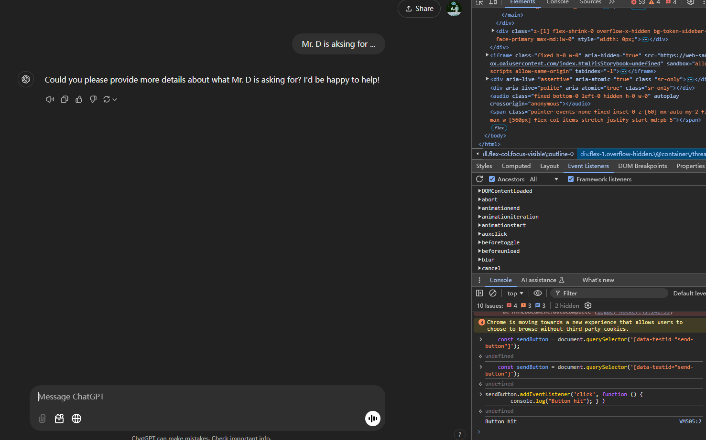
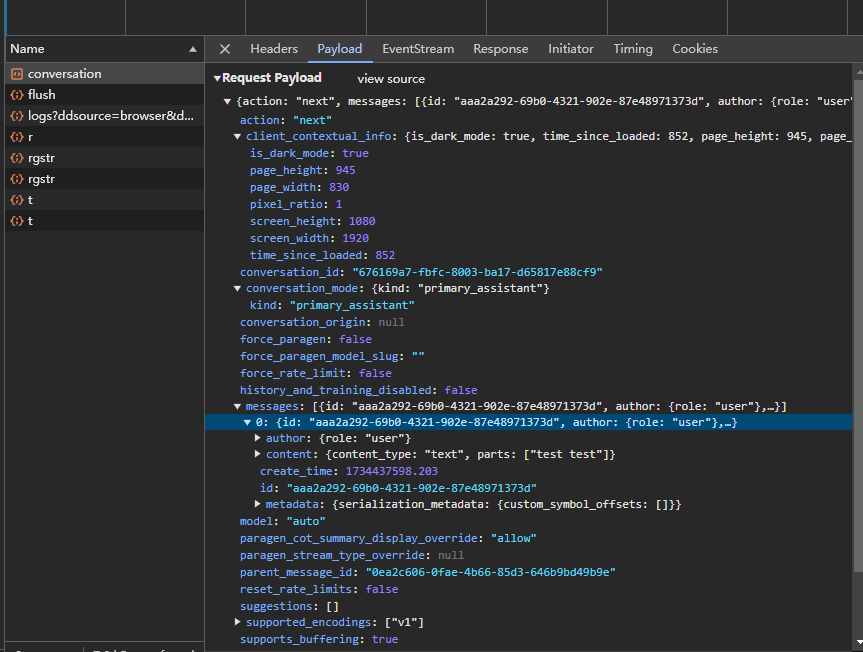

# Chatgpt Tags

Help you to write your Chatgpt prompt easily by choosing tags

## Overview

In this sample, clicking the action button opens a red triangle image in a new tab.

## Running this extension

1. Clone this repository.
2. Load this directory in Chrome as an [unpacked extension](https://developer.chrome.com/docs/extensions/mv3/getstarted/development-basics/#load-unpacked).
<!-- 3. Pin the extension from the extension menu.
4. Click the extension's action icon to open the red triangle in a new tab. -->

Notes:

